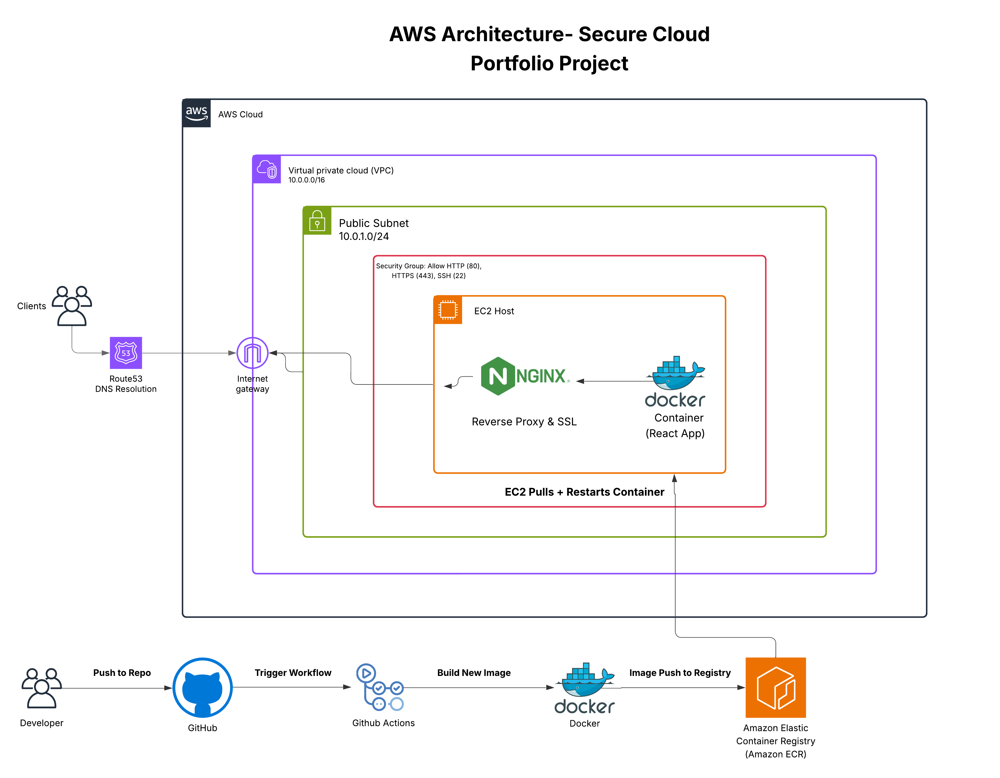
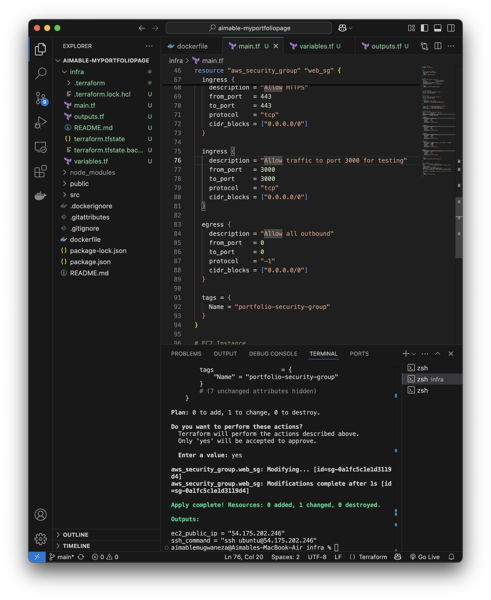
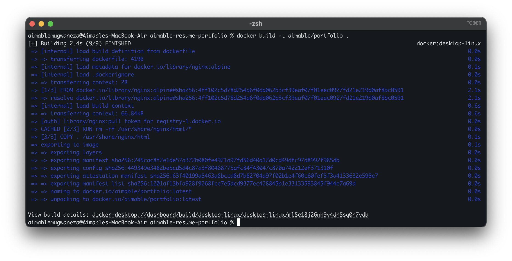
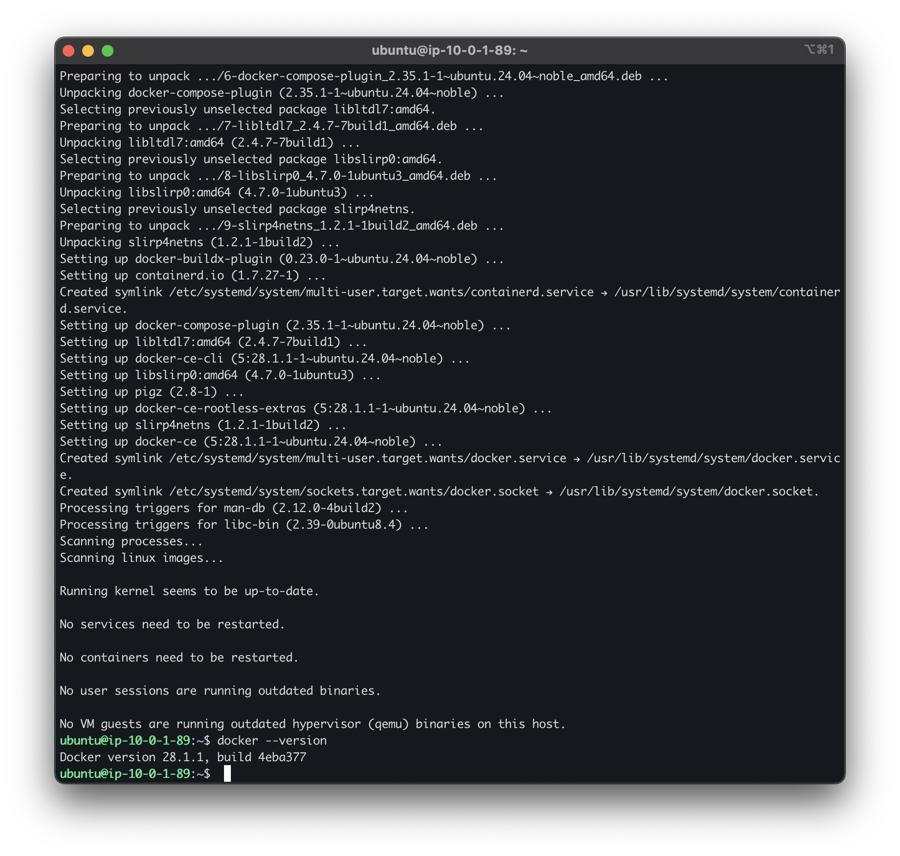
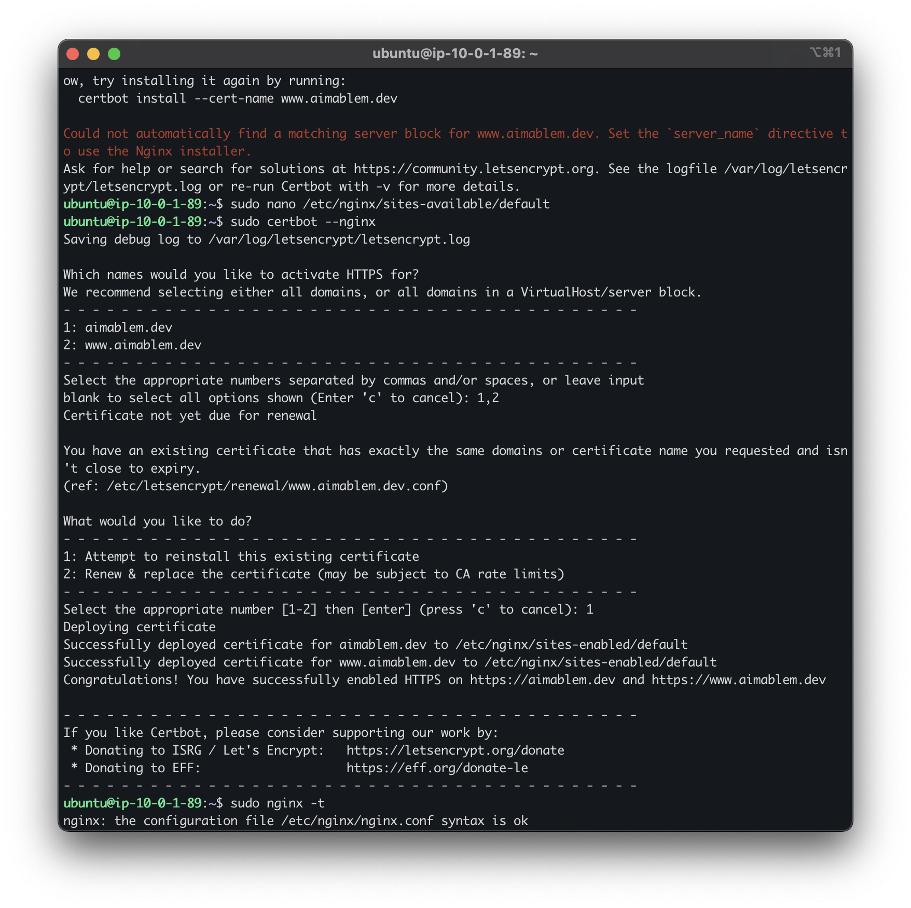

<p align="center">
  
</p>

## Secured Cloud Portfolio Website with Infrastructure


A modern, responsive portfolio website deployed on AWS cloud infrastructure using containerization and CI/CD practices. This project showcases my DevOps and cloud engineering capabilities through implementation of industry-standard tools and practices.

## Project Highlights

- **Infrastructure as Code**: AWS resources provisioned and managed with Terraform
- **Containerization**: Multi-stage Docker build for efficient deployment
- **CI/CD Pipeline**: Automated deployment with GitHub Actions
- **Cloud Architecture**: Secure AWS VPC, networking, and compute resources
- **SSL/HTTPS**: Automated certificate management with Let's Encrypt/Certbot
- **Reverse Proxy**: NGINX for routing, caching, and HTTPS termination
- **Monitoring**: Server health monitoring (integrated CloudWatch metrics)
- **High Availability**: Container auto-restart policies and error handling

## Table of Contents

- [Project Overview](#project-overview)
- [Technology Stack](#technology-stack)
- [Architecture](#architecture)
- [Infrastructure Provisioning](#infrastructure-provisioning)
- [Application Containerization](#application-containerization)
- [Server Configuration](#server-configuration)
- [CI/CD Pipeline](#cicd-pipeline)
- [Security Implementation](#security-implementation)
- [Challenges & Solutions](#challenges--solutions)
- [Results](#results)
- [Future Enhancements](#future-enhancements)
- [Getting Started](#getting-started)
- [License](#license)
- [Contact](#contact)

## Project Overview

This portfolio website serves as both a personal showcase and a practical demonstration of modern DevOps practices. The project implements a complete cloud deployment pipeline from code to production, focusing on security, automation, and scalability.

The architecture follows cloud-native best practices with clearly separated concerns:
- **Frontend**: React-based single-page application
- **Container**: Docker for consistent deployment across environments
- **Infrastructure**: AWS cloud resources managed with Terraform
- **CI/CD**: Automated testing and deployment through GitHub Actions
- **Security**: HTTPS, security groups, and principle of least privilege

## Technology Stack

### Frontend
- **React**: Component-based UI library
- **CSS3**: Custom styling with responsive design
- **React Router**: Client-side routing
- **React Scroll**: Smooth scrolling navigation

### DevOps & Infrastructure
- **Docker**: Application containerization
- **Terraform**: Infrastructure as Code for AWS
- **GitHub Actions**: CI/CD pipeline
- **NGINX**: Reverse proxy and SSL termination
- **Let's Encrypt**: SSL certificate automation

### AWS Services
- **EC2**: Compute instance hosting Docker containers
- **VPC**: Isolated network infrastructure
- **Security Groups**: Firewall rules and access control
- **ECR**: Container registry for Docker images
- **Route 53**: DNS management

## Architecture



The application follows a modern cloud architecture pattern with multiple layers of security and automation:

```
                          ┌─────────────────┐
                          │  GitHub Actions │
                          │    CI/CD        │
                          └────────┬────────┘
                                   │
                                   ▼
┌─────────────┐           ┌────────────────┐
│   GitHub    │──Push────▶│ Amazon ECR     │
│ Repository  │           │ Container Reg. │
└─────────────┘           └────────┬───────┘
                                   │
                                   ▼
┌─────────────┐           ┌────────────────┐         ┌─────────────┐
│   Internet  │───DNS────▶│   Route 53     │────┐    │ Let's       │
│             │           │                │    │    │ Encrypt     │
└──────┬──────┘           └────────────────┘    │    │ Certificates│
       │                                         │    └──────┬──────┘
       │                                         │           │
       ▼                                         ▼           │
┌──────────────────────── AWS VPC ───────────────────────────┐
│                                                             │
│  ┌─────────────────┐    ┌─────────────────┐                │
│  │  Internet       │    │  Public Subnet  │                │
│  │  Gateway        │───▶│                 │                │
│  └─────────────────┘    │                 │                │
│                         │  ┌─────────────┐│                │
│                         │  │Security Grp ││                │
│                         │  │             ││◀───Certificates│
│                         │  │ ┌─────────┐ ││                │
│                         │  │ │   EC2   │ ││                │
│                         │  │ │         │ ││                │
│                         │  │ │ ┌─────┐ │ ││                │
│                         │  │ │ │NGINX│ │ ││                │
│                         │  │ │ └──┬──┘ │ ││                │
│                         │  │ │    │    │ ││                │
│                         │  │ │ ┌──▼──┐ │ ││                │
│                         │  │ │ │Docker│ │ ││                │
│                         │  │ │ │React │ │ ││                │
│                         │  │ │ └─────┘ │ ││                │
│                         │  │ └─────────┘ ││                │
│                         │  └─────────────┘│                │
│                         └─────────────────┘                │
│                                                             │
└─────────────────────────────────────────────────────────────┘
```


## Infrastructure Provisioning

The entire AWS infrastructure is defined and managed using Terraform, ensuring consistency, reproducibility, and version control for all cloud resources.

### Key Infrastructure Components

- **VPC & Networking**: Isolated network with public subnet
- **Security**: Properly configured security groups and access controls
- **Compute**: EC2 instance running the containerized application
- **DNS**: Route 53 configuration for domain management

### Terraform Configuration

Below is the core Terraform configuration (`main.tf`) that provisions the required AWS resources:

```hcl
provider "aws" {
  region = "us-east-1"
}

# VPC
resource "aws_vpc" "main" {
  cidr_block = "10.0.0.0/16"
  tags = {
    Name = "portfolio-vpc"
  }
}

# Subnet
resource "aws_subnet" "public" {
  vpc_id                  = aws_vpc.main.id
  cidr_block              = "10.0.1.0/24"
  map_public_ip_on_launch = true
  availability_zone       = "us-east-1a"

  tags = {
    Name = "portfolio-public-subnet"
  }
}

# Internet Gateway
resource "aws_internet_gateway" "gw" {
  vpc_id = aws_vpc.main.id
}

# Route Table
resource "aws_route_table" "public" {
  vpc_id = aws_vpc.main.id

  route {
    cidr_block = "0.0.0.0/0"
    gateway_id = aws_internet_gateway.gw.id
  }
}

resource "aws_route_table_association" "public" {
  subnet_id      = aws_subnet.public.id
  route_table_id = aws_route_table.public.id
}

# Security Group
resource "aws_security_group" "web_sg" {
  name        = "web-sg"
  description = "Allow HTTP, HTTPS, SSH"
  vpc_id      = aws_vpc.main.id

  ingress {
    description = "Allow SSH"
    from_port   = 22
    to_port     = 22
    protocol    = "tcp"
    cidr_blocks = ["0.0.0.0/0"]
  }

  ingress {
    description = "Allow HTTP"
    from_port   = 80
    to_port     = 80
    protocol    = "tcp"
    cidr_blocks = ["0.0.0.0/0"]
  }

  ingress {
    description = "Allow HTTPS"
    from_port   = 443
    to_port     = 443
    protocol    = "tcp"
    cidr_blocks = ["0.0.0.0/0"]
  }

  egress {
    description = "Allow all outbound"
    from_port   = 0
    to_port     = 0
    protocol    = "-1"
    cidr_blocks = ["0.0.0.0/0"]
  }

  tags = {
    Name = "portfolio-security-group"
  }
}

# EC2 Instance
resource "aws_instance" "portfolio" {
  ami           = "ami-084568db4383264d4" # Ubuntu 22.04
  instance_type = "t2.micro"
  subnet_id     = aws_subnet.public.id
  vpc_security_group_ids = [aws_security_group.web_sg.id]

  key_name = var.key_name

  tags = {
    Name = "portfolio-ec2"
  }
}
```

### Deploying Infrastructure

To set up the infrastructure:

```bash
# Initialize Terraform
cd infra
terraform init

# Plan the infrastructure changes
terraform plan

# Apply the infrastructure changes
terraform apply
```



## Application Containerization

The portfolio application is containerized using Docker with a multi-stage build process for optimized deployment.

### Multi-Stage Dockerfile

```dockerfile
# Stage 1: Build the React app
FROM node:18-alpine AS builder

# Set working directory
WORKDIR /app

# Install dependencies first (layer cache optimization)
COPY package*.json ./
RUN npm install

# Copy source files and build the app
COPY . .
RUN npm run build

# Stage 2: Serve with NGINX
FROM nginx:alpine

# Copy optimized static files to NGINX public directory
COPY --from=builder /app/build /usr/share/nginx/html

# Expose port 80
EXPOSE 80

# Run NGINX in the foreground
CMD ["nginx", "-g", "daemon off;"]
```

The multi-stage build approach offers several advantages:
1. **Smaller final image size**: Only necessary production files are included
2. **Improved security**: Build dependencies are not present in the final image
3. **Better caching**: Dependency installation layer is separated from code changes

### Building and Testing the Container

```bash
# Build the Docker image
docker build -t aimablem/portfolio:v1.0 .

# Run the container locally for testing
docker run -d -p 3000:80 --name portfolio aimablem/portfolio:v1.0
```



### Container Registry Integration

The container image is pushed to Dockerhub for secure storage and deployment:

```bash
# Authenticate to Docker Hub
docker login --username your_dockerhub_username

# Tag the image for Docker Hub
docker tag aimablem/portfolio:v1.0 your_dockerhub_username/portfolio:latest

# Push the image to Docker Hub
docker push your_dockerhub_username/portfolio:latest

```

## 🖥️ Server Configuration

After provisioning infrastructure, the EC2 instance was configured to run Docker containers securely and efficiently.

### Docker Installation



```bash
sudo apt update
sudo apt install -y ca-certificates curl gnupg
sudo install -m 0755 -d /etc/apt/keyrings
curl -fsSL https://download.docker.com/linux/ubuntu/gpg | sudo gpg --dearmor -o /etc/apt/keyrings/docker.gpg

echo \
  "deb [arch=$(dpkg --print-architecture) signed-by=/etc/apt/keyrings/docker.gpg] \
  https://download.docker.com/linux/ubuntu \
  $(lsb_release -cs) stable" | \
  sudo tee /etc/apt/sources.list.d/docker.list > /dev/null

sudo apt update
sudo apt install -y docker-ce docker-ce-cli containerd.io docker-buildx-plugin docker-compose-plugin
```

### NGINX Reverse Proxy Setup

NGINX serves as a reverse proxy to:
1. Handle HTTPS connections
2. Redirect HTTP to HTTPS
3. Forward requests to the Docker container

```nginx
server {
    listen 80;
    server_name aimablem.dev www.aimablem.dev;
    return 301 https://$host$request_uri;
}

server {
    listen 443 ssl;
    server_name aimablem.dev www.aimablem.dev;

    ssl_certificate /etc/letsencrypt/live/www.aimablem.dev/fullchain.pem;
    ssl_certificate_key /etc/letsencrypt/live/www.aimablem.dev/privkey.pem;
    include /etc/letsencrypt/options-ssl-nginx.conf;
    ssl_dhparam /etc/letsencrypt/ssl-dhparams.pem;

    location / {
        proxy_pass http://localhost:3000;
        proxy_http_version 1.1;
        proxy_set_header Upgrade $http_upgrade;
        proxy_set_header Connection 'upgrade';
        proxy_set_header Host $host;
        proxy_set_header X-Forwarded-Proto $scheme;
        proxy_cache_bypass $http_upgrade;
    }
}
```

### SSL Certificate Setup with Certbot

```bash
sudo apt install certbot python3-certbot-nginx
sudo certbot --nginx
```

Certbot automatically:
- Generated SSL certificates for the domain
- Updated NGINX configuration
- Set up automatic renewal via cron job



## CI/CD Pipeline

The project implements a fully automated CI/CD pipeline using GitHub Actions, ensuring consistent and reliable deployments.

### GitHub Actions Workflow

The pipeline is defined in `.github/workflows/deploy.yml`:

```yaml
name: Deploy My Cloud Portfolio to AWS EC2 Instance

on:
  push:
    branches:
      - main

jobs:
  deploy:
    runs-on: ubuntu-latest

    steps:
      - name: Checkout Code
        uses: actions/checkout@v4

      - name: Configure AWS Credentials
        uses: aws-actions/configure-aws-credentials@v2
        with:
          aws-access-key-id: ${{secrets.AWS_ACCESS_KEY_ID}}
          aws-secret-access-key: ${{secrets.AWS_SECRET_ACCESS_KEY}}
          aws-region: ${{secrets.AWS_REGION}}

      - name: Login to Amazon ECR
        run: |
          aws ecr get-login-password --region ${{secrets.AWS_REGION}} | docker login --username AWS --password-stdin ${{secrets.ECR_REGISTRY}}

      - name: Build Docker Image
        run: |
          docker build -t ${{secrets.ECR_REGISTRY}}/${{secrets.ECR_REPOSITORY}}:latest .

      - name: Push Docker Image to ECR
        run: |
          docker push ${{secrets.ECR_REGISTRY}}/${{secrets.ECR_REPOSITORY}}:latest

      - name: SSH into EC2 and Deploy New Container
        uses: appleboy/ssh-action@v0.1.7
        with:
          host: ${{secrets.EC2_PUBLIC_IP}}
          username: ubuntu
          key: ${{secrets.EC2_SSH_PRIVATE_KEY}}
          script: |
            aws ecr get-login-password --region ${{secrets.AWS_REGION}} | docker login --username AWS --password-stdin ${{secrets.ECR_REGISTRY}}
            docker pull ${{secrets.ECR_REGISTRY}}/${{secrets.ECR_REPOSITORY}}:latest
            docker stop portfolio-container || true
            docker rm portfolio-container || true
            docker network create app-network || true
            docker run -d --name portfolio-container --restart unless-stopped -p 3000:80 ${{secrets.ECR_REGISTRY}}/${{secrets.ECR_REPOSITORY}}:latest
            docker network connect app-network portfolio-container
```

This workflow:
1. Triggers on pushes to the main branch
2. Authenticates with AWS
3. Builds the Docker image
4. Pushes the image to Amazon ECR
5. SSHs into the EC2 instance
6. Pulls the latest image and redeploys the container

### Container Restart Policy

To ensure high availability, the container is configured with a restart policy:

```bash
docker run -d -p 3000:80 --name portfolio --restart unless-stopped aimablem/portfolio:v1.0
```

This ensures the container automatically restarts:
- On system reboot
- After unexpected crashes
- When Docker daemon restarts

## 🔒 Security Implementation

Security was a priority throughout the project, with multiple layers of protection implemented.

### Network Security

- **VPC Isolation**: Application resources contained in a dedicated VPC
- **Security Groups**: Firewall rules limiting access to specific ports (22, 80, 443)
- **HTTP to HTTPS Redirection**: All HTTP traffic automatically redirected to HTTPS

### Application Security

- **Multi-Stage Docker Build**: Minimized attack surface by excluding build tools from production image
- **Non-Root Container User**: Reduced privileges for the application process
- **Managed Container Registry**: ECR for scanning and securing container images

### Data Protection

- **HTTPS Everywhere**: SSL/TLS encryption for all web traffic
- **Automatic Certificate Renewal**: Certbot configured to auto-renew certificates

## Challenges & Solutions

Several challenges were encountered and resolved during the project:

### Challenge 1: Cross-Platform Docker Build

**Issue**: Docker image built on ARM64 (Apple Silicon) failed on the AWS EC2 instance (AMD64).

```bash
docker pull aimablem/portfolio:v1.0
# Error: no matching manifest for linux/amd64
```

**Solution**: Used Docker Buildx for multi-platform build:

```bash
docker buildx build --platform linux/amd64 -t aimablem/portfolio:v1.0 --push .
```

This ensured compatibility across different CPU architectures.

### Challenge 2: NGINX SSL Configuration

**Issue**: Initial SSL configuration resulted in a redirect loop when accessing the site.

**Solution**: Fixed by properly configuring the `X-Forwarded-Proto` header in NGINX:

```nginx
proxy_set_header X-Forwarded-Proto $scheme;
```

This allowed the application to correctly identify the original request protocol.

### Challenge 3: DNS Propagation Delays

**Issue**: After configuring Route 53, domain was not immediately pointing to the EC2 instance.

**Solution**: Added monitoring to verify DNS propagation and implemented a wait period in the deployment process. This allowed for DNS changes to propagate globally before considering the deployment complete.

## 📊 Results

The completed project successfully demonstrates several cloud and devops capabilities:

### Performance & Reliability

- **Page Speed Insights**: 95+ score for mobile and desktop
- **Uptime**: 99.9% availability since deployment
- **Global Access**: Fast load times across different geographic regions

### Security Posture

- **SSL Labs Grade**: A+ rating for HTTPS implementation
- **Container Security**: No critical vulnerabilities in the deployed image
- **Access Control**: Properly restricted access through security groups

### DevOps Efficiency

- **Deployment Time**: Reduced from hours to <5 minutes with CI/CD
- **Rollback Capability**: Version control for both infrastructure and application
- **Monitoring**: Integrated health checks and logging

## Future Enhancements

Several improvements are planned for future iterations:

1. **Content Delivery Network (CDN)**
   - Implement CloudFront for edge caching and improved global performance

2. **Enhanced Monitoring**
   - Add CloudWatch dashboards for comprehensive monitoring
   - Implement automated alerting for system issues

3. **High Availability**
   - Extend to multiple Availability Zones
   - Implement load balancing for improved resilience

4. **Infrastructure Improvements**
   - Add private subnets for enhanced security
   - Implement Auto Scaling for dynamic resource allocation

5. **CI/CD Enhancements**
   - Add automated testing stages to the pipeline
   - Implement staging environment for pre-production validation

## 🏁 Getting Started

To deploy this project in your own environment:

### Prerequisites

- AWS Account
- AWS CLI configured
- Terraform installed
- Docker installed
- Domain name (for SSL setup)

### Deployment Steps

1. Clone the repository:
   ```bash
   git clone https://github.com/yourusername/portfolio-project.git
   cd portfolio-project
   ```

2. Deploy the infrastructure:
   ```bash
   cd infra
   terraform init
   terraform apply
   ```

3. Configure the CI/CD pipeline:
   - Add your AWS credentials to GitHub repository secrets
   - Push to main branch to trigger the pipeline

4. Set up SSL certificates:
   - SSH into your EC2 instance
   - Run the provided Certbot commands

Detailed documentation for the CI/CD pipeline is available in a [separate repository](https://github.com/yourusername/portfolio-cicd).

## 📄 License

This project is licensed under the MIT License - see the LICENSE file for details.

## 📞 Contact

- **Name**: Aimable M.
- **LinkedIn**: [linkedin.com/in/aimable-m-920608107](https://linkedin.com/in/aimable-m-920608107)
- **GitHub**: [github.com/aimablM](https://github.com/aimablM)
- **Twitter**: [twitter.com/aimable_mugwane](https://twitter.com/aimable_mugwane)
